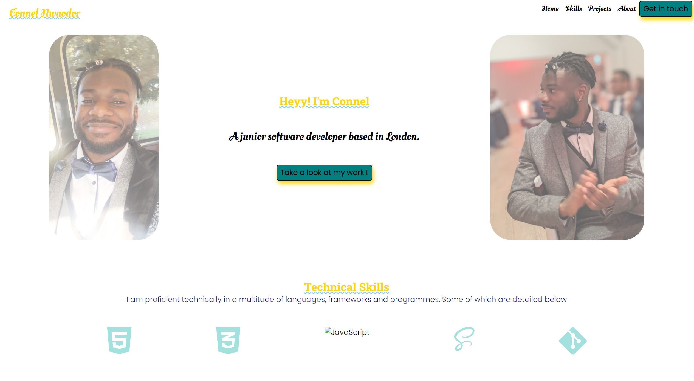
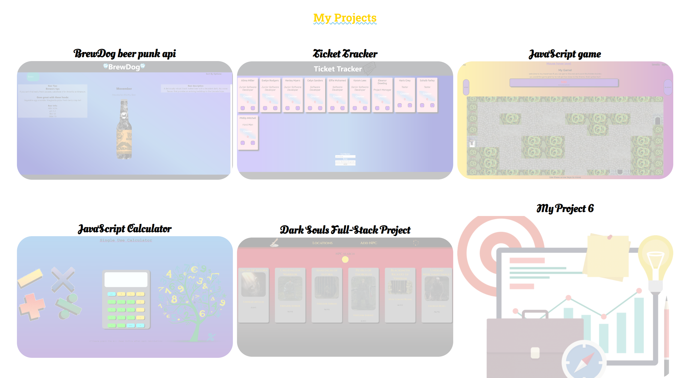
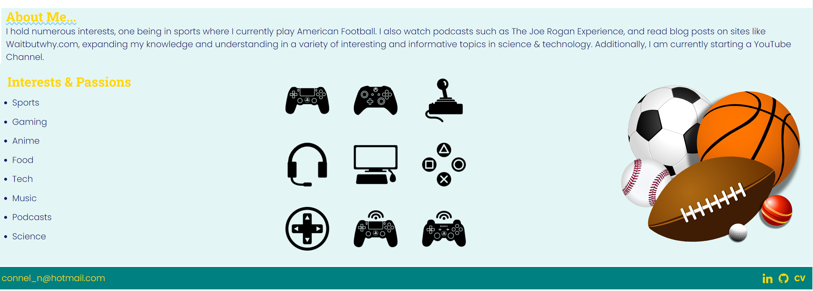

# My Portfolio

## Table of Contents

- [About](#about)
- [Project](#project)
- [What was used](#usage)
- [Future Scope](#future)

## About 

This project is a portfolio designed by myself showcasing projects that I have made, and technical skills that I am competent and confident in. Also, there is a section more about me as a person holding my hobbies, things that I am interested in and a bit more information about me.

## Project 

### Screenshots

### Link to project

To visit the site please click <a href="https://connz17.github.io/student-portfolio/#">HERE</a>

## What was used 

This project was made using HTML and SCSS.

## Future Scope 
